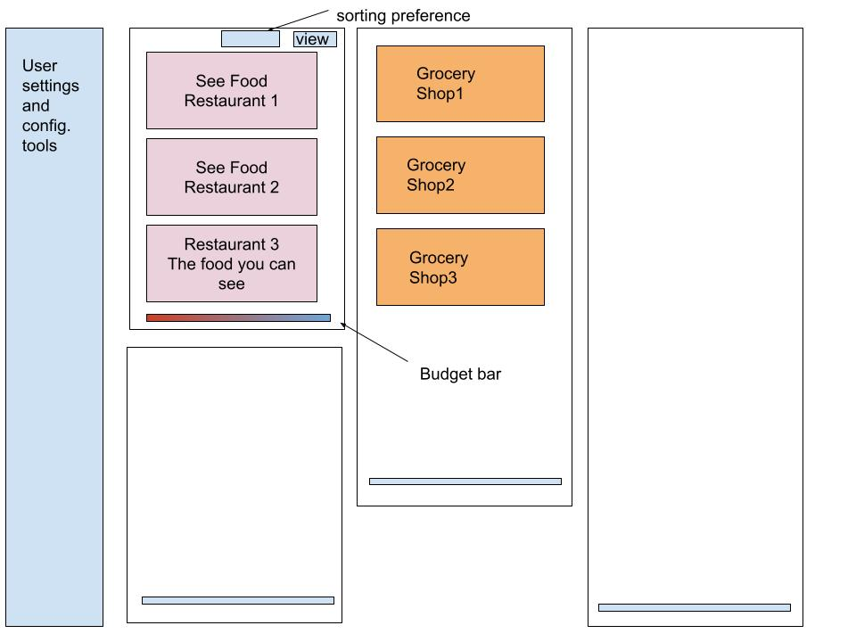

## Budget Map 

UI Prototype:

- Budget map is an App that explores stores around users, it features filtering and queryigng on the user's preferred budget and provides estimate of spending for living in the area.

- This is a prototype 

Author: Liahng Jyun, Liu
lj2liu@uwaterloo.ca

#### Dev note:

Created budget-map at /Users/evaliu/side/buget_map/budget-map
Inside that directory, you can run several commands:

  npm start
    Starts the development server.

  npm run build
    Bundles the app into static files for production.

  npm test
    Starts the test runner.

  npm run eject
    Removes this tool and copies build dependencies, configuration files
    and scripts into the app directory. If you do this, you can’t go back!

We suggest that you begin by typing:

  cd budget-map
  npm start